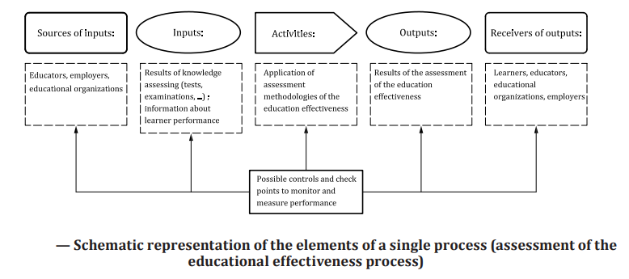
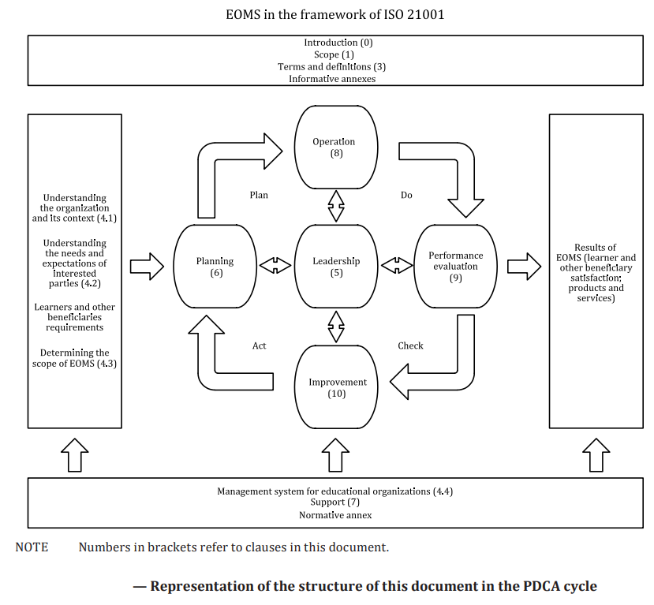
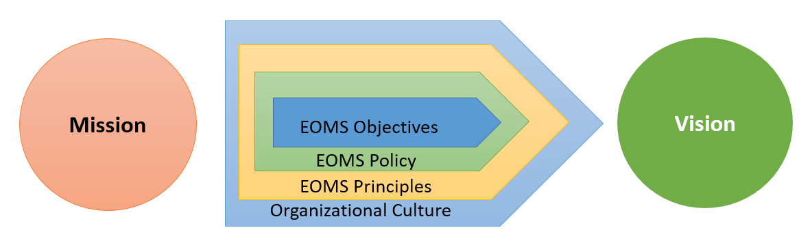

.. ISO21001 documentation master file, created by
   sphinx-quickstart on Sun Oct 10 20:45:53 2021.
   You can adapt this file completely to your liking, but it should at least
   contain the root `toctree` directive.

Process Approach of ISO 21001
====================================

.. toctree::
   :maxdepth: 2
   :caption: Contents:
   
  
   

| This document promotes the adoption of a process approach when developing, implementing and improving the effectiveness of an EOMS, to enhance learner and other beneficiary satisfaction by and meeting learner and other beneficiary requirements.

| Understanding and managing interrelated processes as a system contributes to the organization’s effectiveness and efficiency in achieving its intended results. This approach enables the organization to control the interrelationships and interdependencies among the processes of the system, so that the overall performance of the organization can be enhanced. 

| The process approach involves the systematic definition and management of processes, and their interactions, so as to achieve the intended results in accordance with the policy, objectives and strategic plan of the organization. Management of the processes and the system as a whole can be achieved using the PDCA cycle with an overall focus on risk-based thinking aimed at taking advantage of opportunities and preventing undesirable results. 

| **The application of the process approach in an EOMS enables:**

| — understanding and consistency in meeting requirements

| — the consideration of processes in terms of added value

| — the achievement of effective process performance

| — improvement of processes based on evaluation of data and information

|

| The above given image gives a schematic representation of any process and shows the interaction of its elements. The monitoring and measuring check points, which are necessary for control, are specific to each process and will vary depending on the related risks.

**Plan-Do-Check-Act cycle**

| The Plan-Do-Check-Act (PDCA) cycle can be applied to all processes and to the EOMS as a whole. 

| **The PDCA cycle can be briefly described as follows:**

| — **Plan:** establish the objectives of the system and its processes, and the resources needed to deliver results in accordance with learners' and other beneficiaries' requirements and the organization’s policies, and identify and address risks and opportunities;
| — **Do:** implement what was planned;
| — **Check:** monitor and (where applicable) measure processes and the resulting products and services against policies, objectives, requirements and planned activities, and report the results;
| — **Act:** take actions to improve performance, as necessary.

**Risk-based thinking**
Risk-based thinking is essential for achieving an effective EOMS. To conform to the requirements of this document, an organization needs to plan and implement actions to address risks and opportunities. Addressing both risks and opportunities establishes a basis for increasing the effectiveness of the quality management system, achieving improved results and preventing negative effects.

| Opportunities can arise as a result of a situation favourable to achieving an intended result, e.g. a set of circumstances that allow the organization to attract learners and other beneficiaries, develop new products and services, reduce waste or improve productivity. Actions to address opportunities can also include consideration of associated risks. Risk is the effect of uncertainty and any such uncertainty can have positive or negative effects. A positive deviation arising from a risk can provide an opportunity, but not all positive effects of risk result in opportunities.

| **Organizational mission, vision and strategy**

| Below given figure illustrates EOMS strategy as related to mission and vision

| **EOMS strategy as related to mission and vision**

| The EOMS policy statements are framed by the organization’s culture (the complete set of beliefs and values that condition its behaviour) and by the EOMS principles. In turn, the EOMS policy statements provide the framework for the establishment of the EOMS objectives, which are periodically revised to ensure the organization’s mission is effectively and efficiently accomplished while walking the continuous path towards the achievement of the organization’s vision. The articulation of these elements is usually called a strategy.

