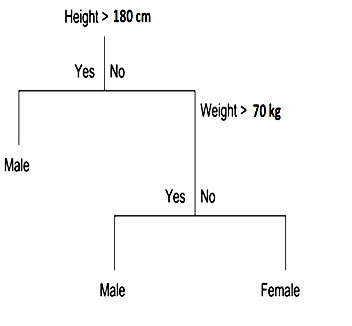

SET: MCQs for Previous Lab session (To be used on Sat 2nd April)
=====================================================================

1. The test set passes through the same transformation before applying predict method that has been done on the training set before modelling (fit method).

A. True
B. False

Answer: A (True)

	
2. Polynomial transformation is applied to the entire data set if required. 

A. True
B. False

Answer: B (False)
Polynomial transformation is applied to the features only and the target remains as it is, untouched.

3. A data set has 5 features and 100 instances for regression, which of the following are the possible shape of feature and theta array for applying in Gradient descent. Consider a few instances are kept aside for testing purposes.

A. Feature : (100 , 5) &  theta: (5 , 1)
B. Feature : (100 , 6) &  theta: (6 , 1)
C. Feature : (80 , 5) &  theta: (6 , 1)
D. Feature : (80 , 6) &  theta: (6, 1)

Answer: D

4. Which of the following are most important parameter in Kernalized SVM   with Radial Basis Function (RBF)?

A. C, coef0, degree
B. C, gamma
C. C,coef0
D. None of above

Answer: B

5. The contour plot of the cost/loss function is almost concentric after standardization and gradient descent runs smoothly till the optimum point.

A. True
B. False

Answer: A

SET: MCQs for Previous Concept Lecture (To be used on Sun 3rd April, morning)
----------------------------------------------------------------------------------

1. Classify the sample (Height = 140 cm, Weight = 65 kg) to find whether it belongs to the class Male / Female by using the given Decision Tree. 

A.	Male
B.	Female 

Answer: B 

2. Decision Tree classifier is a …………………… machine learning algorithm. 

A. Supervised  
B. Unsupervised 

Answer: A 

3. A decision tree is built in which of the following fashion? 

A. top down 
B.  bottom up 

Answer: A 

4. Choose the correct sequence of steps for k-fold cross-validation:

1. Use k-1 parts of the data for training and 1 part for validation to find error/performance metric 
2. Divide the sample data into k parts 
3. Repeat the cross-validation process ‘k’ times using a distinct part each time as test data.
4. Take an average of the ‘k’ number of results (error/performance metric) with distinct validation sets each time to produce the final result

A. 2,1,3,4
B. 1,2,3,4
C. 3,1,2,4
D. 4,1,3,2

Answer: A

5. Bootstrapping works on....... 

A. Random sampling with replacement 
B. Random sampling without replacement 
C. Ordered sampling with replacement 
D. Ordered sampling without replacement 

Answer: A 

SET: MCQs for Previous Industry Lecture (To be used on Sun 3rd April, afternoon)
^^^^^^^^^^^^^^^^^^^^^^^^^^^^^^^^^^^^^^^^^^^^^^^^^^^^^^^^^^^^^^^^^^^^^^^^^^^^^^^^^^^^^

1.	Which of the following is not the criterion for data split in Decision Tree classification using sklearn?

A.	gini
B.	entropy
C.	information gain
D.	None of the above

Answer: C
Only ‘Gini’ and ‘Entropy’ are available as criterion in decision tree. Information gain is evaluated as a difference in entropy before and after splitting the data.

2. Which of the following is/are correct statement?

A. A good model has high variance.
B.	A good model has high bias.
C.	Overfitting means high variance.
D.	Under fitting means low bias.

Answer: C
High Variance: Model is able to perform (predict) very well in training set but fail in test set. Not desirable for good model.
High Bias: Model is so simple that not even able to perform in training set. Not desirable for good model.
Overfitting: Model is able to only perform very well in training set i.e. high variance. The model has memorized the training data but not able to generalize.  
Under fitting: Model is too simple and not able to perform in training data as well i.e. similar to high bias. 
C is only correct statement.

3.	Which of the following algorithm is inherently having high variance?

A.	Linear Regression
B.	Decision Tree
C.	Both 
D.	None

Answer: B
Decision Tree has the nature of high variance (overfitting) and to control/reduce it following parameters are tuned: max\_depth, min\_samples\_split, min\_samples\_leaf, max\_features, max\_leaf\_node, etc...

4.	Same kind of estimators/predictors can be used in ensemble method.

A.	True
B.	False

Answer: B (False)
Ensemble methods work best when the predictors are as independent from one another as possible. One way to get diverse classifiers is to train those using very different algorithms. This increases the chance that they will make very different types of errors, improving the ensemble accuracy.

5.	Voting classifier aggregate the predictions of each classifier and predict the class that gets the most votes. This majority-vote classifier is called a soft voting classifier.

A. False
B.	True

Answer: A (False)
Voting classifier aggregate the predictions of each classifier and predict the class that gets the most votes. This majority-vote classifier is called a hard voting classifier.
If all classifiers are able to estimate class probabilities, then we can tell Scikit –Learn to predict the class with the highest class probabilities. This is called soft voting classifier.

