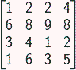
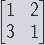
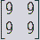
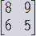
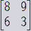

SET: MCQs for Previous Lab session (To be used on Sat 9th April)
=========================================================================

1. Given below is a confusion matrix. Choose the correct precision.
 		array ([[10,  3],
       			[7, 7]])

A. 0.7
B. 0.5
C. 0.3
D. 1

Answer: A 
From the confusion Matrix: TP=7, FP=3, Precision= TP/(TP+FP) =7/(7+3) = 0.7

2. Given below is a confusion matrix. Choose the F1 Score.
 		array ([[10,  3],
       			[7, 7]])

A. 3.44
B. 0.29
C. 1.72
D. 0.58

Answer: D
Use this formula: F1=2∗precision∗recall / (precision recall)
 = 2*0.7*0.5 / (0.7+0.5) = 0.58

3. Using only the decision tree inside the bagging classifier is almost equivalent to a random forest classifier.

A. True
B. False

Answer: A

4. Bootstrap is false means sampling is done with replacement.

A. True
B. False

Answer: B

5. If we allow the decision tree to grow till pure leaf which of the following is/are a true statement?

A. There will be under-fitting in the model
B. There will be over-fitting in the model.
C. The accuracy on the training set will be high but fails in the test set.
D. All of above
E. None of above

Answer: B, C
The model will be overfitting i.e. the accuracy on the training set will be high but fails in the test set.

SET: MCQs for Previous Industry Lecture 
------------------------------------------

1. Without activation functions in MLP, the relationship between features and the predicted output will be such that 

A. the function is nonlinear.
B. all the weight & bias in the different layers will have just a linear combination
C. the function is linear
D. None

Answer: B & C

2. Backpropagation is equivalent to the gradient descent.

A. True
B. False

Answer: B (False)
Gradient it calculated for each layer in backpropagation which is used in gradient descent to update weights and biases of respective layers.

3. In multiclass classification, which of the following activation function is best suitable in the hidden layers of MLP for fast computation?

A. Softamax
B. Sigmoid
C. Tanh
D. ReLu

Answer: D

4. In multiclass classification, which of the following activation function is best suitable in the output layer of MLP?

A. Softamax
B. Sigmoid
C. Tanh
D. ReLu

Answer: A 

5. Given below is the forward pass equation for first hidden layer having 3 nodes and a dataset having ‘m’ instances with 4 features has been passed through it. What will be the shape of 

.. math:: A^{[1]} ?

.. math:: Z^{[1]} = W^{[1]} X + b^{[1]}
.. math:: A^{[1]} = σ (Z^{[1]})

A. (3, 4)
B. (4, m)
C. (m, 3)
D. (3,m)

Answer: D
Shape of X -> (4, m) & Shape of W -> (3, 4) 
Finally, shape of WX -> (3, m), and ‘b’ will be added to it after broadcasting. (3, m) is the shape of Z, which remains same after passing through activation function sigma. Thus shape of A is equal to (3, m).

SET: MCQs for Previous Concept Lecture 
^^^^^^^^^^^^^^^^^^^^^^^^^^^^^^^^^^^^^^^^^^^^

1. The XOR output is 1 if the inputs are -----------------? 

A. Different 
B. Same
C. Finite
D. Infinite

Answer: A

2. A perceptron is..... classifier.

A. a linear
B. a non-linear 
C. a probabilistic 
D. All of above

Answer: A

3. Which of the following statements is correct, regarding a Perceptron? 

A. It has an input layer, a hidden layer and an output layer
B. It can draw non-linear decision boundaries 
C. It can function only as a binary classifier
D. None of above

Answer: C 

4. XOR problem can be solved by:

A. MLP
B. Gradient Descent
C. Perceptron
D. All of the above

Answer: A

5. What will be the output after max pooling with 2X2 filters and stride 2 in the following data layer? 

A. 

B. 

C.  

D. 

Answer: C
