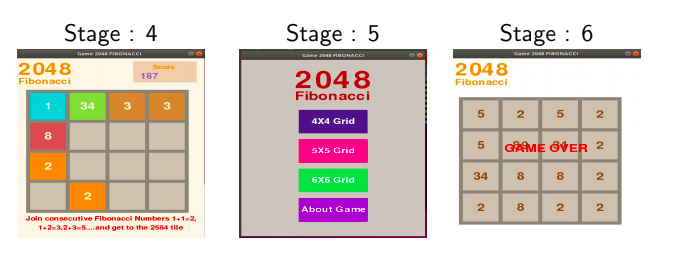

2048 Fibonacci Game
====================

Description 
------------

The Fibonacci version of the 2048 game! 
Move tiles by swiping to any direction. Tiles with consecutive Fibonacci numbers will merge, get to the 2584 title to win! 
Each Fibonacci number is the sum of the previous two numbers: 1, 1, 2, 3, 5, 8, 13,.....2584

Rules
------

Use the arrow keys or WASD to slide the tiles around the board. Combine numbers that are next to each other in the Fibonacci sequence to make
bigger numbers. See if you can get to 2584!The Fibonacci numbers are a list (called a "sequence") of numbers that is built a very special way. It starts with 1,1... and then you add 1 + 1 to get to the next number.

 

That gives 1,1,2... Then you add 1+2 to get the next number...
That gives 1,1,2,3... Then you add 2+3 to get the next number...
That gives 1,1,2,3,5 ... Then you add 3+5 to get the next number...
That gives 1,1,2,3,5,8... Then you add 5+8 and you keep going!

1, 1, 2, 3, 5, 8, 13, 21, 34, 55, 89...

 
Fibonacci numbers is defined by the recurrence relation F_n = F_{n-1} + F_{n-2},

Fibonacci numbers are important because they reflect many patterns found in nature - for example, the pattern of petals on flowers.

This version is based on the 2048 game by Gabriele Cirulli.

Stages
-------

