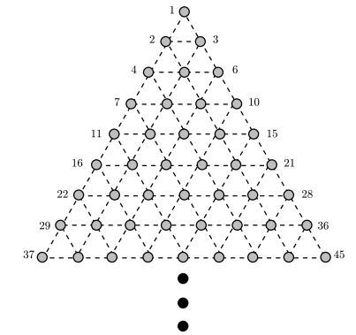
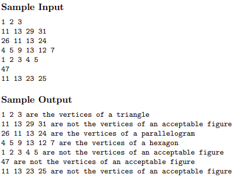

Triangular Vertices 
====================

Description 
------------

Consider the points on an infinite grid of equilateral triangles as shown below:

Note that if we number the points from left to right and top to bottom, then groups of these points form the vertices of certain geometric shapes. For example, the sets of points {1,2,3} and {7,9,18} are the vertices of triangles, the sets {11,13,26,24} and {2,7,9,18} are the vertices of parallelograms, and the sets {4,5,9,13,12,7} and {8,10,17,21,32,34} are the vertices of hexagons.

Write a program which will repeatedly accept a set of points on this triangular grid, analyze it, and determine whether the points are the vertices of one of the following “acceptable” figures: triangle, parallelogram, or hexagon. In order for a figure to be acceptable, it must meet 
the following two conditions:

1) Each side of the figure must coincide with an edge in the grid.

2) All sides of the figure must be of the same length.

Input
------

The input will consist of an unknown number of point sets. Each point set will appear on a separate line in the file. There are at most six points in a set and the points are limited to the range 1 . . . 32767.

Output
-------

For each point set in the input file, your program should deduce from the number of points in the set which geometric figure the set
potentially represents; e.g., six points can only represent a hexagon, etc. The output must be a series of lines listing each point set 
followed by the results of your analysis.

